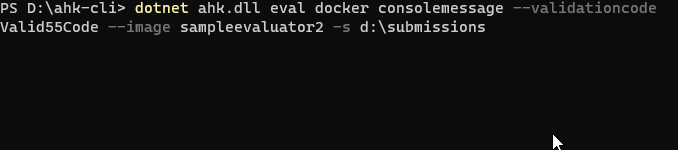
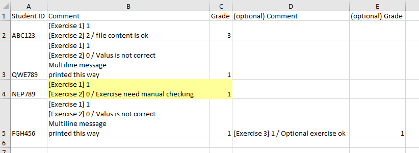

# Ahk Cli

[`Ahk-cli`](https://github.com/akosdudas/ahk-cli) is a console application written in .NET Core for executing the evaluation of homeworks locally on your machine based on containers. This application targets step 3 of the [automated evaluation process](index.md): running the evaluation program on the student submissions.

Using this application the process of evaluation is as follows.

1. Write a program that tests the student's work. The program must be containerized; `ahk-cli` only works with containers.
1. Download the students' work and place each of them into separate folders. (For example, use [Classroom Assistant](../using-github/collecting-submissions.md#classroom-assistant) for the download.)
1. Run the evaluation using `ahk-cli` and Docker.

    

1. Publish the results of the evaluation. The outcome is an Excel sheet that you can further transform and publish/import.

    

For more information, please refer to the description in the following repository: <https://github.com/akosdudas/ahk-cli>.
