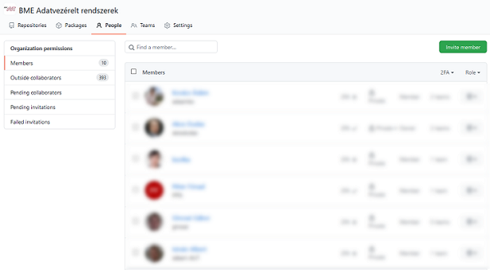
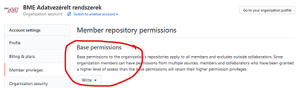
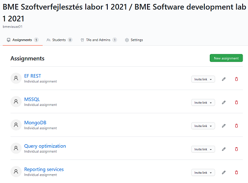
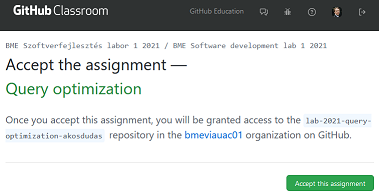
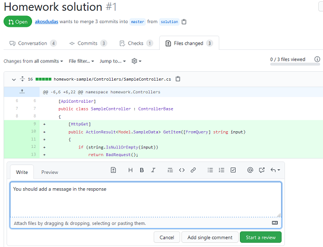

# Collecting submissions

You need a place to collect the submitted assignments. Source code consists of multiple files; thus, it is usually zipped and uploaded somewhere (e.g., Moodle assignment) as a file.

Working with zip files is inconvenient: it has to be downloaded, extracted, opened in a specific tool, like an IDE, the files opened inside the IDE, the entire source compiled, etc. All these steps are error-prone ("who was the student that this zip belongs to?"), manual and laborious (clicking a lot), and not very safe (opening files from not exactly trusted sources; just remember the [zip slip vulnerability](https://snyk.io/research/zip-slip-vulnerability).)

## GitHub Classroom

[GitHub Classroom](https://classroom.github.com) is a tool built into GitHub that automates collecting submissions. Suppose you want the students to submit the assignment in git repositories. You would need to

1. create a repository for each student,
1. add yourself and other teachers to the repository,
1. add the student to the repository,
1. import the starter code,
1. and send the link to the student.

This process is precisely what GitHub Classroom does. Once you have a [GitHub organization](index.md#github-organization), you can use the organization to "collect" all the git repositories from your students. **The students will not own the repositories; the organization will own them**, and the students are added to the repositories (only their repositories) as collaborators. Teachers and yourself will be able to access all of these repositories just by being part of the organization.

## Set up GitHub Classroom

Setting up GitHub Classroom consist of steps you need to perform once, and steps that you will need to repeat each semester.

1. Create the GitHub organization if you don't have one yet. See recommendations [here](index.md#github-organization).

1. Add other teachers to this organization as members. These members will be able to access specified content within the organization.

    { : .img-center }

1. [Configure the _base permission_](https://docs.github.com/en/github/setting-up-and-managing-organizations-and-teams/setting-base-permissions-for-an-organization) inside the organization. This permission determines whether organization members (theses are the teachers and _not_ the students) have access to the students' submissions.

    { : .img-center }

    Set the base permission to **read** so that every organization member (again, these are your teachers) can read all repositories to check student submissions.

    Or set the base permission to **write** to enable organization members to contribute to the students' repositories. Contribution means being able to add comments to the source code or merge pull requests.

1. Sign up for [GitHub Education](https://education.github.com/teachers) benefits. If you teach at an academic institution, this is free after verifying your status. This process (as of today) consists of two steps: verify your status and then upgrade your GitHub organization to have the benefits applied.

    GitHub Education is not necessarily required. GitHub (again, as of today) offers organizations and public repositories free of charge. But if you want private repositories, you need to pay for it - or request the discount. Private repositories are useful so that students do not see each other's work.

1. Open [GitHub Classroom](https://classroom.github.com/), sign-in, and [create a new classroom](https://docs.github.com/en/education/manage-coursework-with-github-classroom/manage-classrooms#about-classrooms). A _classroom_ can be, for example, your _Programming databases 2021 spring_ course.

    !!! tip "Classroom per course and per semester"
        The _classroom_ provides you with a level of organization. Create a new classroom each semester, and archive old classrooms.

1. When creating the _classroom_, you will be offered to [create a _roster_](https://docs.github.com/en/education/manage-coursework-with-github-classroom/manage-classrooms#about-classroom-rosters). The problem the roster tries to solve is the mapping of students to repositories.

    !!! danger "Careful with the roster"
        Identifiers, like names or student ID numbers, are considered sensitive information and should not be published in the roster! In the European Union, the GDPR is quite strict about such matters. Therefore, you should make sure whether using a roster is possible for you.

        Check the [alternative method](#not-using-a-student-roster) proposed below.

1. Inside the _classroom_, create as many _assignments_ as you need. Create one for each homework.

    Each assignment has a name and a repository name prefix. The repository name prefix will be used when the student's repository is created. Make sure to provide a meaningful name; i.e., "homework" will not be enough.

    !!! tip "Assignment names and repository prefixes"
        A recommended assignment name, for example, is "Microsoft SQL Server programming" or "Homework 1 Java".

        The repository name prefix should include:

          - a short prefix to separate these repositories from all others, e.g., "hw",
          - the year or semester,
          - and the short name of the assignment.
        
        This prefix will be postfixed with the student's GitHub account name, so it will look like this: `hw-2021-mssql-tinystar774`.

    This is how one of my classrooms look like:

    { : .img-center }

1. The assignment will enable you to specify a _starter code template repository_. This repository will be used to populate the newly created repository for the student. This template repository is your [starter code](publishing-specification.md#starter-code-in-a-repository).

1. Finally, note the assignment's _invitation URL_. This is the link you should communicate to your students.

    !!! danger "The invitation URL should not be public"
        This URL will enable _anyone_ to create a repository in your organization. **Do not publish it on a public website.** I have seen a public invitation URL being abused, resulting in the entire GitHub organization being disabled.

## How does all this help you?

Students need only **click the invitation** link (see below), and their own personal repository will be created for them. There is no room for error here.

{ : .img-center }

Members of the organization will have **access to all submission repositories**, while students only see their personal repository. You can control access by adding teachers to the organization as members.

The **starter code is automatically copied** into the student's repository. Automating this step is also useful to avoid questions and problems, such as

- students not finding the download link to the starter code,
- corrupted downloads,
- not being able to extract a file due to not having A or B compression tool installed,
- messing up file names with special characters or spaces in the name,
- creating an extra unnecessary directory after extracting an archive,
- etc. (Add your favorite "how did this happen, really?" anecdote in here.)

You **do not need to download students' code** or extract it. The source code is available inside a web browser and you can review it with ease. For more details, see [Using pull requests](providing-feedback.md#using-pull-requests).

{ : .img-center }

## Not using a student roster

Students get dedicated repositories in GitHub. The problem you will face is to map the repositories to students. The names of the repositories will contain the GitHub user names of students, but that will not be enough. The student roster of GitHub helps this by mapping the student's name to the repository, but it will not change the repository names. Thus it will still be complicated to find the repository for a student. Not to mention the previously noted privacy issues.

Instead of the roster, I recommend two other approaches.

### Option 1: Adding the student identifier to a specified text file in the repository

Add a dedicated empty text file into the starter code repository into which the students must type their unique ID number. E.g., my university, BME, assigns a so-called _Neptun-code_ to everyone. Thus, I add an empty `neptun.txt` into the [root of the starter code repository](https://github.com/akosdudas/ahk-sample-startercode/blob/master/neptun.txt), and the assignment instructions tell the students to type their code into this file.

There are simple benefits to this solution. First, the mapping of the student with the repository exists inside the repository. If I see a repository, I can check whom it belongs to by checking the file contents. Second, GitHub has extensive search capabilities. I can find the repository of a student by executing a search within the organization, which will match the contents of these text files too. And finally, automation can check the existence of this text file and its content.

GitHub has a continuous integration system, called [GitHub Actions](https://github.com/features/actions), enabling us to execute scripts on the student repositories automatically. For example, you can check the text file upon each commit and report an error to the student when there is a problem. An example for such action is available here: <https://github.com/akosdudas/ahk-action-neptuncheck>. This is a GitHub Action specification, which can be [included in a workflow](https://github.com/akosdudas/ahk-sample-studentsolution/blob/master/.github/workflows/evaluate.yml#L18).

!!! note "Customized checking"
    This action requires a specific file name and content. Feel free to reuse it or fork it and create your own!

### Option 2: Registering repository names in a Microsoft Form or Google Forms

You can publish a registration form using [Microsoft Forms](https://forms.office.com/) or [Google Forms](https://www.google.com/forms/about/) and ask your students to add their repository URL along with their student ID number. This solution is simple but error-prone if students forget this. Plus, you will not have the search capability as in the previous option.

## Classroom Assistant

Once you have the student repositories "in the cloud," i.e., in GitHub, how do you work with them? One option is [using pull requests](providing-feedback.md#using-pull-requests), and the other one is to download them to your machine. I download the repositories for archival purposes at the end of the semester.

How do you download hundreds of repositories? [GitHub Classroom Assistant](https://classroom.github.com/assistant) is a handy tool that enables mass download of all repositories of a Classroom assignment. I have been using this tool to download up to 250 repositories per assignment.

Another way for mass download is scripting with the help of [PowerShellForGitHub PowerShell Module](https://github.com/microsoft/PowerShellForGitHub). Since all repositories created by Classroom have an identical prefix, you can search for these repositories and clone them all in a script.

## Downsides of using GitHub Classroom

GitHub and GitHub Classroom is not a universal solution for all. There are drawbacks and downsides of the techniques presented here. Without going into further details, here is a short list for consideration.

- Requires a GitHub account. It is free, though, but still asks the student to use a third-party service.
- Working with git is not always easy. The trivial tasks are simple, but once we get to branching, it tends to get complicated for students who don't have much practice with it. I recommend using good git clients, like [GitHub Desktop](https://desktop.github.com/), and promoting these to students too.
- There are occasional downtimes at GitHub. Like all cloud services, there are unexpected errors from time to time. In the past years, I have seen students experience intermittent errors dozens of times. It even prohibited us from completing a class once. You need a communication platform (Microsoft Teams, Slack channel, email list, etc.) to let students know when something is not working. Not all of them are experienced enough to recognize a real problem and to know when just a retry is needed.
- GitHub has its own terminology, like branches and pull requests. But we need assignments and submissions. You have to accept the fact that there is a misalignment here.
