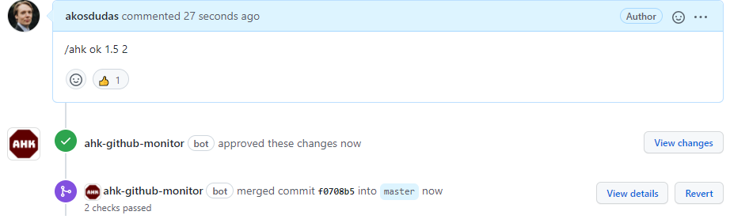

# Further automation

Using GitHub as a platform allows us to add further automation into the homework submission process.

## [Ahk GitHub Automation](https://github.com/akosdudas/ahk-github-automation)

[Ahk GitHub Automation](https://github.com/akosdudas/ahk-github-monitor) is a set of tools, open-source, of course, that enable such automation. It consists of:

- _GitHub Monitor_: An Azure function written in .NET Core with a http webhook registered as a GitHub Application that manages the workflow of homework submissions. Performs automatic actions on repositories acting as submissions and monitors proper usage of pull reqeusts.
- _Publish Results to PR_: A containerized Go application that processes the output of evaluator applications and publishes the results to the student into a pull request, as well as forwarding it to the grade management application.
- _Grade Management_: An Azure function written in .NET Core that accepts grades from the other applications and stores them in Azure CosmosDB database. Helps teachers by reducing the administration of submissions and grades.

Below you find some features of these apps. For more information, please refer to the description in the following repository: <https://github.com/akosdudas/ahk-github-automation>.

## GitHub branch protection rules

[GitHub pull requests](../using-github/providing-feedback.md#using-pull-requests) come in handy for seeing the cumulative code changes of the student and for providing feedback. However, it relies on the student performing some mandatory steps: creating a branch and opening a pull request. The more manual steps there are, the bigger the chance of messing something up. The most critical part is working on the right branch in git. If the student pushes content to the wrong branch, it will require manual work to fix it.

GitHub has so-called [_branch protection rules_](https://docs.github.com/en/github/administering-a-repository/managing-a-branch-protection-rule#about-branch-protection-rules), which can help to prohibit students from doing something wrong.

**Branch-protection rule for the main/master branch.** By protecting the main/master branch with a rule that requires at least one pull request approval, the student cannot add or merge any code into the main/master branch. Therefore, the main/master branch has the initial starter code and the pull request opened by the student will gather all changes made to the code since.

**Branch-protection rule for all working branches.** You should protect all other branches too by prohibiting force push. If a student wants to "play around" with the automated evaluation and "be smart about it" in any way, these attempts could be hidden by rewriting the past of git using force push. A branch protection rule can prohibit this.

Unfortunately, there is no way to set these branch protection rules on students' repositories using GitHub Classroom. But a GitHub App can subscribe to events, such as new branch creation, and add these rules via GitHub's API.

## Recognizing when a comment is changed

The pull request-based process relies on publishing the outcome of the automated evaluation as a comment into the pull request thread. The students have write permission to the repository enabling them to edit comments. So technically, a student could edit the comment added by the automation tool and change the contents. Although the comment would appear as _edited_, it might not be recognized by the teacher. The solution is to subscribe to the event of comment editing and verifying that students do not touch comments other than their own - or publish a warning when this happens.

## Accepting a submission and finalizing the grade

Once a student submits a homework, the instructor needs to check it and grade it. To reduce the manual work required from the instructor the automatically assigned grades can be recorded automatically in a database. Furthermore, using a "chatops-like" command automation can finalize the students submission as follows. By entering the `/ahk ok 1.5 2` command:

1. The pull request is approved (signalling both acceptance to the student and allowing merging);
1. The pull request is merged (while this is not really necessary, it is in accordance with software development best prectises);
1. And the final grades/point (the numbers) are recorded in the database too.

{ : .img-center }

Using this command simplifies the instructors job. There is no need to manually approve the pull request or to register the grade in Moodle or in Excel.
