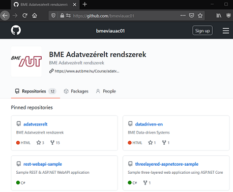

# Using GitHub

[GitHub](https://www.github.com) is a very well-known entity for software developers. It is the de-facto place for open-source software, and it offers convenient tools for us, educators too.

!!! important "This is not an ad"
    I am in no way affiliated with GitHub or Microsoft (the owner of GitHub). This website is not an advertisement to make you use GitHub. The ideas and techniques presented here are merely a description of a technology that efficiently automates homework assessment.

## GitHub organization

When planning on using GitHub, you will need to [create a GitHub organization](https://docs.github.com/en/github/setting-up-and-managing-organizations-and-teams/creating-a-new-organization-from-scratch) for your course. The organization is an umbrella entity to store your class's GitHub content. The organization is also the point of access control, e.g., to allow teaching assistants or team teachers to perform specific tasks.

Here is one of my organizations: <https://github.com/bmeviauac01/>. The organization has a landing page with a name and the most important repositories pinned:

{ : .img-center }

!!! tip "Organization name"
    I recommend using course codes for the organization name. Do not call the organization "prog101"; instead, call it "bmeviauac01" (this is a course code at BME VIK). Use a lowercase name as the name will be part of the URL.

!!! warning "Re-using GitHub organizations"
    You might not need a separate GitHub organization for all your courses. Your university, faculty, or department might already have an organization. You can re-use these organizations, but mind the drawbacks:

    - When using [GitHub Classroom](collecting-submissions.md#github-classroom) you will need a dedicated organization. First, because you need to be an owner of an organization to use GitHub Classroom. And second, GitHub Classroom will create lots of repositories for the student assignments, and you don't want the repositories of various classes being mixed up.
    - Controlling access inside the organization is centralized. Suppose you want to allow a teaching assistant to see and edit content. In that case, you must assign the appropriate role in the organization, which applies to _all_ content in the organization, not just your class.