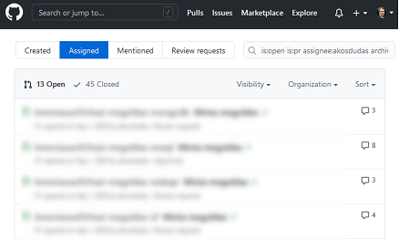

# Provide feedback to students

During the standard assessment of student work feedback is given once, after the subission deadline. For example, the student hands in a paper and receives marks and a grade afterward. Both the submission and the feedback usually happens in a learning management system, like Moodle.

When it comes to source code, giving feedback does not play well with such systems. But the same problem, review of code, has a well-established practice in software development using specific code-review tools.

## Using pull requests

GitHub has a concept called [_pull requests_](https://docs.github.com/en/github/collaborating-with-issues-and-pull-requests/about-pull-requests) frequently used in everyday software development. These pull requests can be used to check students' submission. A pull request is, from a technical point of view, a difference between two git branches. If you ask the students to add their code to a dedicated branch, a pull request can combine all the changes into a single view.

GitHub has a handy user interface for **reviewing the content** of a pull request. You can see all the student's effective changes, and you can [comment on the source code](https://github.blog/2018-05-29-pull-requests-in-the-classroom/) as feedback:

{ : .img-center }

Another added benefit is that pull requests have **assignees**. The assignee can be the teacher assistant responsible for assessing the work. GitHub provides you with a page that lists PRs assigned to you, so this also serves as a todo-list:

{ : .img-center }

---

Using pull requests for feedback requires you or the student to prepare the repository to have the appropriate branches and open the pull request. There are two options for ensuring these.

### Option 1: GitHub Classroom's automated _feedback pull request_

GitHub Classroom has a feature to automatically [create a feedback pull request](https://docs.github.com/en/education/manage-coursework-with-github-classroom/leave-feedback-with-pull-requests#about-feedback-pull-requests-for-assignments). You can enable this option in the assignment's settings. Configuring this will perform the following steps when the repository is created for the student.

1. The source code is imported into the `main/master` branch.
1. A new branch is created.
1. And a pull request is opened (for merging `main/master` into the new branch).

The student can add commits to the `main/master` branch. The PR will show the difference between the original state (the starter code) and the current state of `main/master` providing you with an overview of the student's code changes. You can use the pull request to give the student feedback and comment on the source code.

The advantage of this method (compared to the alternative below) is that it is entirely automated. The downside is that the direction of merging is counter-intuitive. The branch created in step 2 is the target branch of the merge in this scenario. In software development, however, such branches (so-called _feature branches_) are the source of merge, and the `main/master` is the target. This merge is not practical if you want to merge the PR at the end (just like it would happen in a software development scenario) because then the final state would be on a branch other than `main/master`.

### Option 2: Manually creating a branch

The alternative option is to request the student to perform the following manual steps:

1. Create a new branch, e.g., with the name `solution`.
1. Add commits to this branch.
1. When ready, open a pull request (to merge `solution` into `main/master`) and assign it to the correct teacher.

Although there are manual steps here, this option has the following benefits.

- Follows standard software development practices, i.e., opening a feature branch and working on that branch.
- Opening and assigning the PR is the **act of submission**, just like uploading a ZIP/PDF file to a website. This step will appear in the pull request with a timestamp; hence, you can use it to determine if the submission was late.
- Accepting the student's solution happens by merging the pull request. The final source code gets to the `main/master` branch, and closing the PR.
