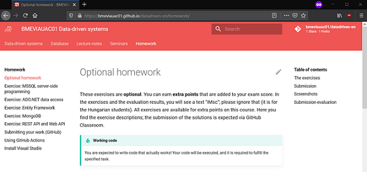

# Publising the assignment

Are you uploading the homework specification as a PDF or ZIP to a university webpage? Making changes to such documents is laborious and error-prone: you need to edit the document, export it, and upload it. If you want to make this easier, then you might try an alternative: use GitHub and GitHub Pages.

## Starter code in a repository

The [stater code](../prerequisites.md#starter-code) is a set of files that the student needs to download to start working on the homework. What better way to store and publish software source code than a git repository?

Create a new repository in the GitHub organization for each homework assignment. The repository name should clearly indicate that it contains starter code, e.g., call it `hw-mssql-starter`. GitHub has a useful feature called [_template repositories_](https://docs.github.com/en/github/creating-cloning-and-archiving-repositories/creating-a-template-repository), which makes it easy to create a new repository by copying the contents from the template.

Check out a sample starter code repository here: <https://github.com/bmeviauac01/gyakorlat-rest-kiindulo>.

## GitHub Pages website

[GitHub Pages](https://pages.github.com/) publishes static websites from git repositories. While it might not be the first thought of many to use git, a version control system, for tasks typically performed in Microsoft Word, using git and static websites has many advantages.

- Requires tools that are convenient for a software developer. We use git daily. And we all have our favorite text editors, such as Notepad++ or Visual Studio Code.
- Has support for versioning. Yes, class materials should be versioned, but keeping older versions lying around with obscure file names, like `v1`, `v2019-last`, or `v2021 NEW` is not professional.
- Making the documentation open-source allows students to propose changes, e.g., to fix typos. It also promotes the open-source initiative.
- Automations take care of publishing a new version. While a Word document is convenient for editing, publishing often requires saving the content as a PDF and then uploading it somewhere. When using GitHub Pages, these can be automated using continuous integration services.

Check out a sample repository here: <https://github.com/bmeviauac01/datadriven-en> is the source code and the published website is available at <https://bmeviauac01.github.io/datadriven-en/>.

{ : .img-center }

The steps for using GitHub pages:

1. Create a new repository.

    If you need a single website in the organization, you can create a repository with the name `organizationname.github.io` published at the address `https://organizationname.github.io`.

    Or you may give a different name to the repository, such as `homeworks`, in which case the address will be `https://organizationname.github.io/homeworks`.

1. Create the website content. There are many ways to do this. Use the source of this repository (upper right corner) to check how this one is built using [MkDocs](https://www.mkdocs.org/), [MkDocs for Material](https://squidfunk.github.io/mkdocs-material/), and [GitHub Pages action](https://github.com/marketplace/actions/github-pages-action).

1. If you need to make a change to the website, edit the source, commit, and finally, push. The standard software development workflow in action, only, this time, for website content.

!!! note "Other platforms"
    [GitLab Pages](https://docs.gitlab.com/ee/user/project/pages/) and [BitBucket](https://support.atlassian.com/bitbucket-cloud/docs/publishing-a-website-on-bitbucket-cloud/) have similar offerings.

!!! tip "Public repository"
    The website can be published for public access from a private repository. By publising the website and the code publicly you can get students engadge. E.g., if they find a typo, they can propose a change to fix it. You need to make the repository public to enable this.

## Alternative option: using cloud-based documents

If you don't want to publish the assignment to the whole world as a website, there is still another way to eliminate PDF files: use Microsoft 365 or Google Docs. You only need to edit the file on your computer or in a web browser, and the "publishing" part is automated. By publishing a read-only link to the document, students can always access the latest version while you can quickly make edits to the document.
